<!-- pandoc -t revealjs -s presentation.md -o presentation.html -V theme=solarized -->

{width=450px}

### Système de suggestion de tags

_Clément ALEXANDRE - OCIML Nov 2024_

____

<style>
  .cv p, .cv img{
    margin:0
  }
  .cv table{
    font-size: 14pt;
    display: inline;
    margin:0;
    margin-right:20px;
    margin-bottom:20px;
  }
  .cv table:last-child{
    margin-right:0;
  }

  </style>

<div class="cv" style="background-color:white;padding-left:20px;padding-right:20px;padding-top:20px;border-radius:10px;">
<div style="display:flex;justify-content:space-between;align-items:center;">
<div>Clément ALEXANDRE</div>

</div>


<div style="display:inline-flex;align-items: start;margin-left:auto; margin-right:auto;">
&nbsp;  | Expérience pro
---: | ---
2022 - AJD | VinoVirtual : Codirigeant / DT
2020 - 2022 | Synbioz : Développeur senior RoR
2014 - 2019 | Margotte tournicote : Codirigeant
2010 - 2011 | Submate : Lead developer
-- | Formateur indépendant
-- | Freelance

&nbsp;  | Formation
---: | ---
2023 - AJD | OC IML
2012 | DU Création d'entreprise
2008 - 2010 | Master Développement web
2006 - 2009 | Licence pro informatique embarquée
2004 - 2006 | DUT GEII
</div>
</div>
____

### Sommaire

1. Rappel de la problématique
1. Conformité RGPD
1. Récupération des données
1. Analyse exploratoire
1. Approche non supérvisée
1. Approche supervisée
1. Exposition API, déploiement continu et POC
1. Mise en oeuvre MLOps
1. Conclusions et perspectives

____

## 1. Rappel de la problématique

**Suggestion automatique de tags** pour **catégoriser** une question posée sur StackOverflow.

::::: {.fragment style="margin-top:40px"}
👉 Améliorer les méta-informations des contenus
:::::
::::: fragment
👉 Améliorer de l'expérience utilisateur
:::::
____

## 1. Conformité RGPD

:::: {style="font-size:20pt"}
&nbsp; | &nbsp;
-----: | :-----
**Finalité** | L'objectif est uniquement de viser à améliorer la  saisie
**Pertinence** | Les données non pertinentes sont filtrées
**Conservation** | Modèle réentraîné périodiquement
**Sécurité**	| Stockage chiffré, accès restreint par mot de passe
**Droit des personnes** | Respect et application des CGV de StackOverflow
::::

____


## Récupération des données

<style>
.left *{
  margin-left:5vw!important;
  text-align:left!important;
}
</style>

:::: left
:::: fragment
1. StackOverflow API (c.f. notebook)
::::

:::: fragment
2. Data Exchange Explorer (solution retenue)
::::

:::: fragment
👉 1000 meilleurs questions mensuelles
::::
::::
___


## Analyse exploratoire des données


___

### Approche non supervisée avec LDA


<div style="display:flex">

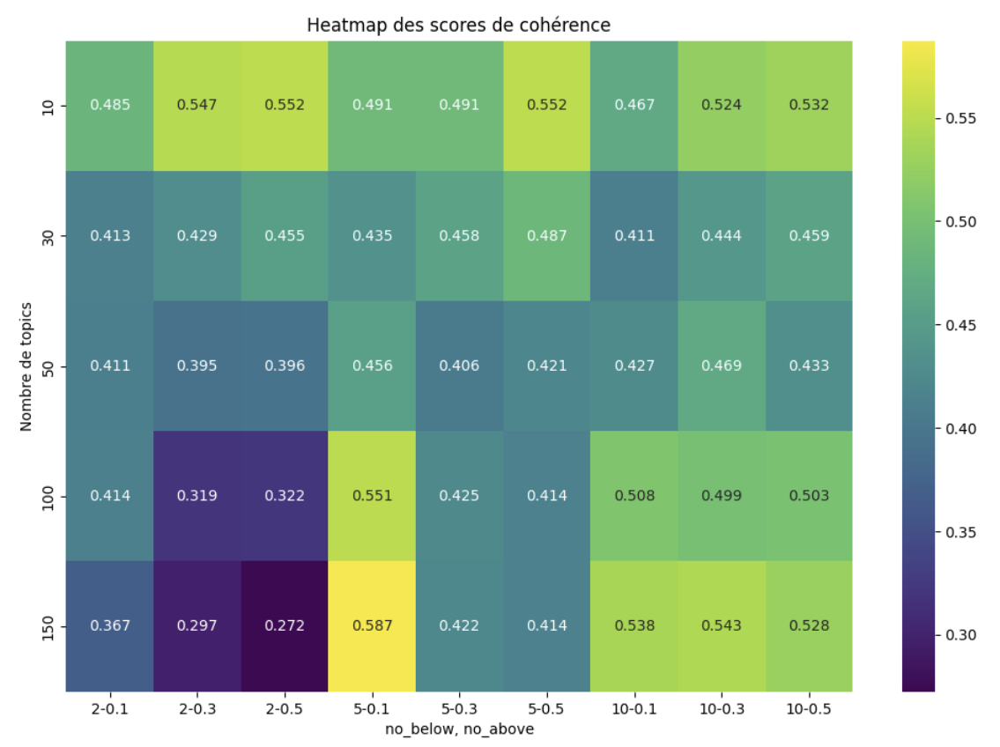{style="height:20vh;width:auto"}

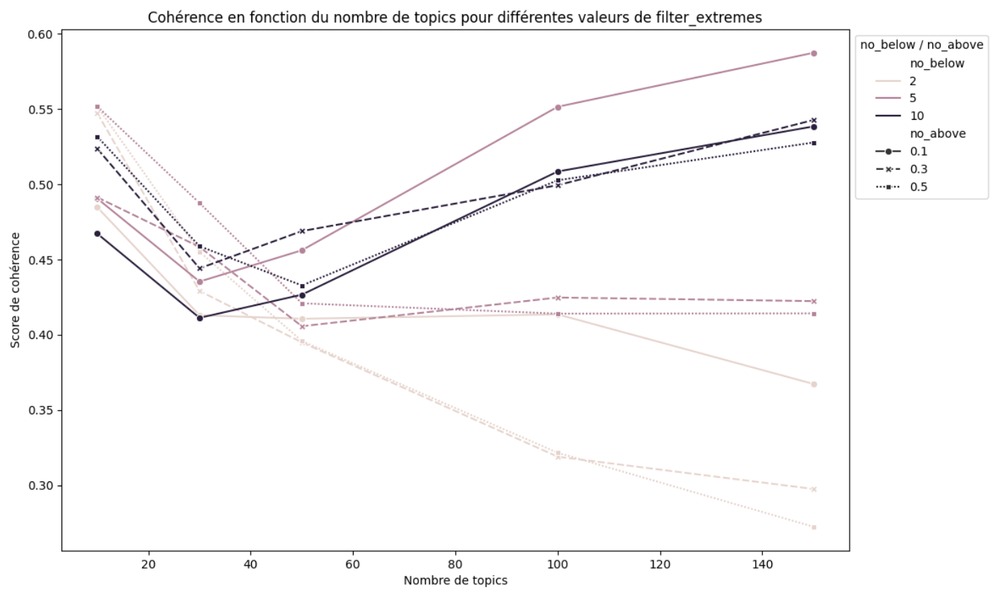{style="height:20vh;width:auto"}

</div>

<style>
  .nomargin *{
    margin: 0!important;
  }
</style>

<div class="nomargin">
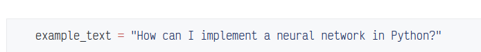
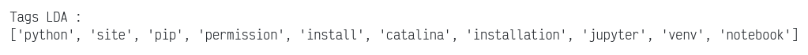
</div>

:::: fragment
👉 Mise en oeuvre délicate
::::


___

### Approche supervisée : Word2Vec

:::: fragment
👉 Entrainement rapide sur jeu de données complet
::::

:::: fragment
👉 Score F1 0.43
::::

:::: fragment
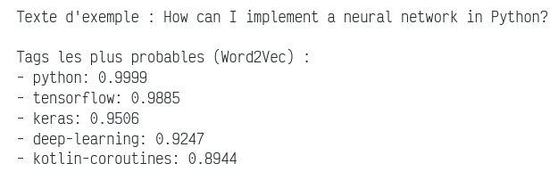
::::

___

### Approche supervisée : USE

:::: fragment
👉 Prétraitement contre-productif
::::

:::: fragment
👉 Score F1 0.35
::::

:::: fragment
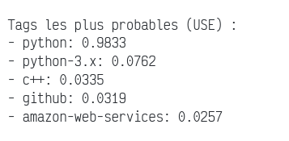
::::

___

### Approche supervisée : Bert

:::: fragment
👉 Prétraitement contre-productif
::::

:::: fragment
👉 3 Go GPU RAM / 1 000 enregistrements
::::

:::: fragment
👉 Score F1 0.41
::::

:::: fragment
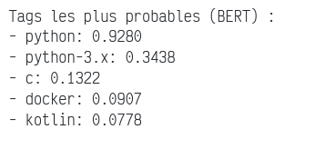
::::

___

### Exposition API et déploiment continu

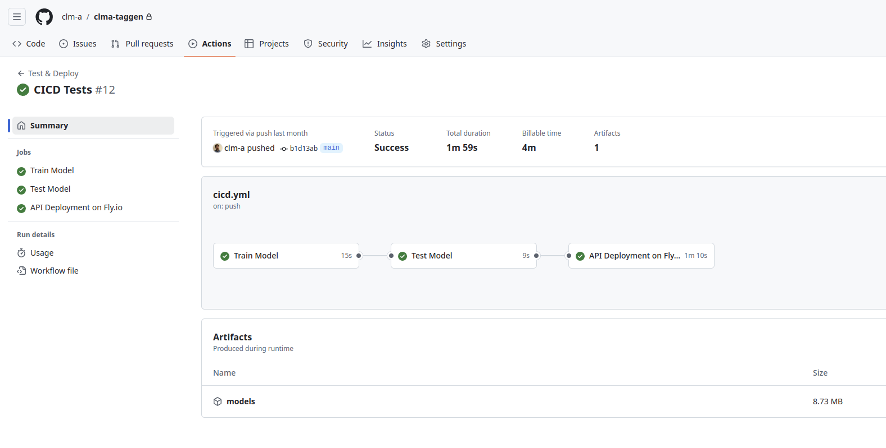{style="height:30vh;width:auto"}


:::: fragment
👉 Sérialisation Joblib / id2word
::::

:::: fragment
👉 Flask / Fly.io
::::


___


### CICD 

<!-- 
```mermaid
sequenceDiagram
    Local->>+GHAction: Push

    GHAction->>GHAction: Train
    GHAction->>GHAction: Test (w/ artifacts)
    GHAction->>+Fly: Deploy
    GHAction->>Fly Image builder: Send context (w/ artifacts)
    Fly Image builder->Fly Image builder: Build and host docker image
    Fly Image builder-/->Fly: pull image
```
-->
<div style="display:flex">
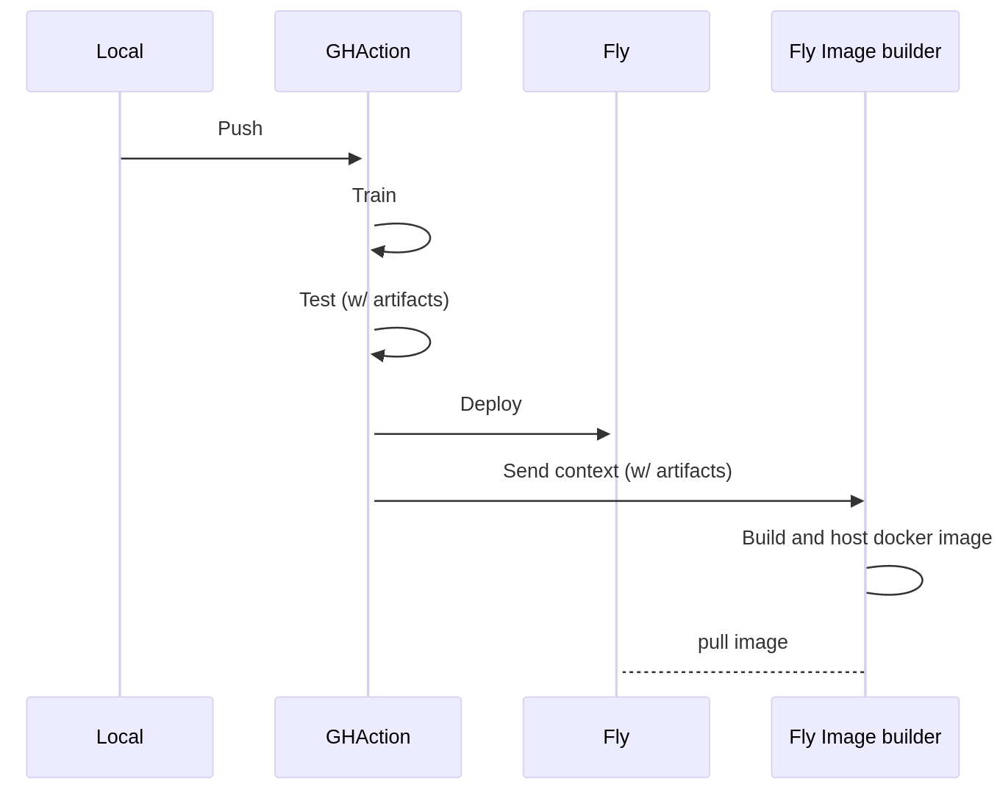{style="height:30vh"}

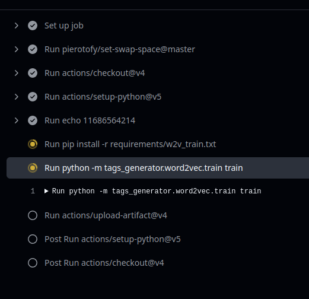
</div>
___


### POC


____

### Approche MLOps

<div style="display:flex">
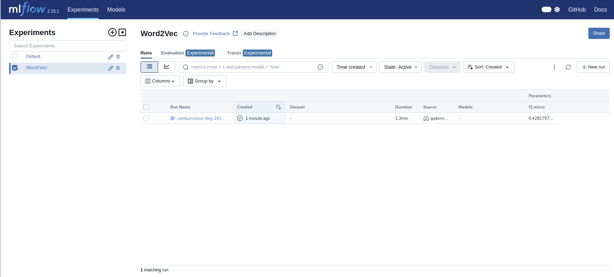

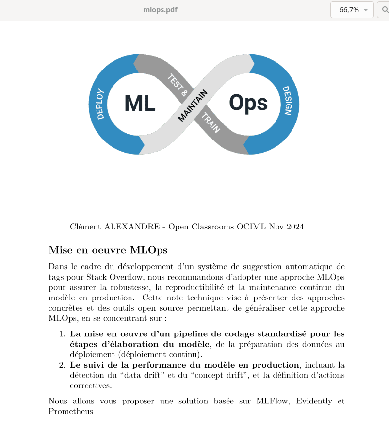
</div>
___

### Conclusions et perspectives

:::: fragment
👉 Word2Vec convaincant avec peu d'optimisations
::::

:::: fragment
👉 Difficulté de mise en oeuvre de BERT y compris en batch
::::

:::: fragment
👉 Enjeu important dans l'optimisation des paramètres pour la stabilité
::::

