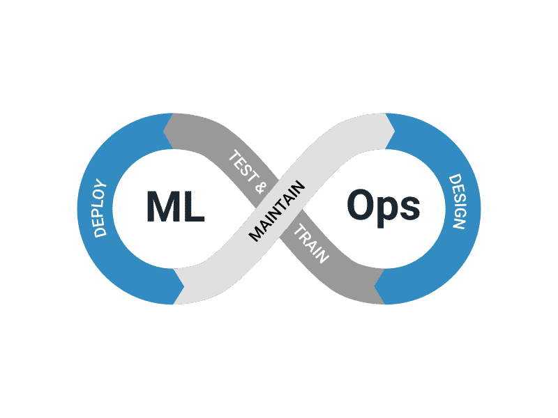

<!-- pandoc -o mlops.pdf mlops.md -->

{ width=450px }

> Clément ALEXANDRE - Open Classrooms OCIML Nov 2024


## Mise en oeuvre MLOps

Dans le cadre du développement d'un système de suggestion automatique de tags pour Stack Overflow, nous recommandons d'adopter une approche MLOps pour assurer la robustesse, la reproductibilité et la maintenance continue du modèle en production. Cette note technique vise à présenter des approches concrètes et des outils open source permettant de généraliser cette approche MLOps, en se concentrant sur :

1. **La mise en œuvre d'un pipeline de codage standardisé pour les étapes d'élaboration du modèle**, de la préparation des données au déploiement (déploiement continu).
2. **Le suivi de la performance du modèle en production**, incluant la détection du "data drift" et du "concept drift", et la définition d'actions correctives.

Nous allons vous proposer une solution basée sur MLFlow, Evidently et Prometheus

\pagebreak

## 1. Utilisation des pipelines

### 1.1. Intérêt des pipelines en MLOps

Dans le contexte de notre projet, qui implique plusieurs étapes complexes (préparation des données, entraînement de modèles supervisés et non supervisés, comparaison des performances, déploiement d'une API), l'utilisation de pipelines permet de :

- **Automatiser les processus** pour réduire les erreurs humaines.
- **Assurer la reproductibilité** des expérimentations.
- **Faciliter la collaboration** entre les membres de l'équipe.
- **Simplifier le déploiement** et la maintenance du modèle en production.

### 1.2. Outils open source pour la création de pipelines


{ height=70px}

#### 1.2.1. Kedro

**Présentation :**

Kedro est un framework Python qui fournit une structure pour organiser les projets de Data Science. Il facilite la création de pipelines modulaires et reproductibles.

**Application pratique au projet :**

- **Organisation du projet :** Kedro impose une structure de projet standardisée, avec des dossiers pour les données brutes, intermédiaires et traitées, le code source, les configurations, etc.
  
  ```bash
  project-root/
  ├── data/
  │   ├── 01_raw/
  │   ├── 02_intermediate/
  │   └── 03_primary/
  ├── notebooks/
  ├── src/
  │   └── project_name/
  │       ├── pipelines/
  │       ├── nodes/
  │       └── ...
  └── conf/
      ├── base/
      └── local/
  ```

- **Définition des pipelines :** Nous pouvons définir des pipelines pour chaque étape du projet :

  - **Pipeline de préparation des données :**
    - Chargement des données depuis Stack Exchange Data Explorer.
    - Nettoyage des données (suppression du HTML, des stop words, lemmatisation).
    - Stockage des données traitées dans le Data Catalog de Kedro.

  - **Pipeline d'entraînement des modèles :**
    - Entraînement des modèle utilisés dans le projet, supervisés (Word2Vec, BERT, USE) ou non (LDA).
    - Stockage des modèles entraînés.

  - **Pipeline d'évaluation :**
    - Calcul des métriques de performance pour chaque modèle.
    - Comparaison des modèles et sélection du meilleur.

- **Intégration avec MLflow :** Kedro peut être intégré avec MLflow pour le suivi des expérimentations. Chaque exécution de pipeline peut enregistrer les paramètres, les métriques et les modèles dans MLflow Tracking.

\pagebreak

**Exemple de code :**

```python
# src/project_name/pipelines/data_engineering/nodes.py

from kedro.io import DataCatalog
from kedro.pipeline import node

def preprocess_data(raw_data):
    # Code de prétraitement
    return processed_data

def train_lda_model(processed_data):
    # Code pour entraîner le modèle LDA
    return lda_model

# Définition des nœuds
preprocessing_node = node(
    func=preprocess_data,
    inputs="raw_data",
    outputs="processed_data",
    name="preprocessing_node"
)

training_node = node(
    func=train_lda_model,
    inputs="processed_data",
    outputs="lda_model",
    name="training_node"
)
```

\pagebreak

{ height=70px}

#### 1.2.2. MLflow Pipelines

**Présentation :**

MLflow Pipelines offre une structure standardisée pour développer et déployer des modèles de Machine Learning. Il fournit des templates pour des tâches spécifiques et facilite l'enregistrement des expérimentations.

**Application concrète au projet :**

- **Utilisation du template de classification :** Nous pouvons utiliser le template de classification pour notre modèle supervisé de suggestion de tags.
  
- **Définition des étapes du pipeline :**

  - **Étape de préparation des données (`ingest`) :** Chargement et nettoyage des données.
  - **Étape de transformation (`transform`) :** Vectorisation des textes avec les embeddings (Word2Vec, BERT, USE).
  - **Étape d'entraînement (`train`) :** Entraînement du modèle supervisé.
  - **Étape d'évaluation (`evaluate`) :** Calcul des métriques et comparaison des modèles.
  - **Étape de déploiement (`register`) :** Enregistrement du meilleur modèle.

**Exemple de commandes :**

```bash
# Initialisation du pipeline
mlflow run . -e ingest

# Transformation des données
mlflow run . -e transform

# Entraînement du modèle
mlflow run . -e train -P model_type=bert

# Évaluation du modèle
mlflow run . -e evaluate

# Enregistrement du modèle
mlflow run . -e register
```

### 1.3. Choix de l'outil

Pour notre projet, **MLflow Pipelines** peut être particulièrement adapté car :

- Nous utilisons déjà **MLflow Tracking** pour enregistrer les expérimentations.
- MLflow facilite le **déploiement des modèles** via MLflow Models.
- L'intégration avec les **embeddings complexes** (BERT, USE) est facilitée.

## 2. Suivi de la performance du modèle en production

### 2.1. Concepts clés

Dans le contexte de Stack Overflow, les données évoluent constamment. De nouveaux types de questions émergent, et la popularité des technologies change avec le temps. Il est donc crucial de surveiller :

- **Data Drift :** Changement dans la distribution des données d'entrée (par exemple, les nouvelles questions concernent davantage une nouvelle technologie).
- **Concept Drift :** Changement dans la relation entre les questions et les tags (par exemple, un tag devient obsolète ou un nouveau tag apparaît).

### 2.2. Outils open source pour le Suivi


{ height=70px}

#### 2.2.1. Evidently AI

**Application concrète au projet :**

- **Surveillance en temps-réel :** Intégrer Evidently dans l'API de prédiction pour surveiller les entrées et les sorties du modèle.
  
- **Rapports automatisés :** Générer des rapports périodiques sur la performance du modèle et les drifts détectés.

\pagebreak

**Implémentation :**

```python
# api/app.py

from evidently.model_monitoring import ModelMonitoring
from evidently.tabs import DataDriftTab, ClassificationPerformanceTab

model_monitoring = ModelMonitoring(
    monitors=[DataDriftTab(), ClassificationPerformanceTab()],
    options={}
)

@app.post("/predict")
def predict(question: str):
    # Prétraitement et prédiction
    prediction = model.predict(question)
    
    # Collecte des données pour Evidently
    model_monitoring.collect(
        reference_data=reference_data,
        current_data=current_data,
        model_predictions=prediction
    )
    
    return {"tags": prediction}
```

- **Déploiement du tableau de bord :**

```bash
evidently ui
```

\pagebreak

{ height=70px }

#### 2.2.2. Prometheus et Grafana

**Application concrète au projet :**

- **Collecte des métriques personnalisées :** Exposer des métriques depuis l'API (nombre de prédictions, temps de réponse, taux d'erreur).

- **Visualisation avec grafana :** Créer des tableaux de bord pour surveiller les métriques en temps réel.

**Implémentation :**

- **Exposition des métriques :**

```python
# api/app.py

from prometheus_client import Counter, Histogram, start_http_server

PREDICTIONS = Counter('app_predictions_total', 'Nombre total de prédictions')
PREDICTION_TIME = Histogram('app_prediction_time_seconds', 'Temps de prédiction')

start_http_server(8000)  # Démarrer le serveur de métriques Prometheus

@app.post("/predict")
@PREDICTION_TIME.time()
def predict(question: str):
    PREDICTIONS.inc()
    # Prétraitement et prédiction
    prediction = model.predict(question)
    return {"tags": prediction}
```

\pagebreak

### 2.3. Conception du système de suivi

#### 2.3.1. Indicateurs et mesures

- **Métriques de performance :**

  - **Précision des prédictions :** Pourcentage de tags correctement prédits.
  - **Taux de couverture des tags :** Proportion de tags existants couverts par le modèle.
  - **Temps de réponse de l'API :** Pour assurer une bonne expérience utilisateur.

- **Indicateurs de drift :**

  - **Fréquence des Mots Clés :** Surveillance des mots clés les plus fréquents dans les nouvelles questions.
  - **Changements dans les Distributions des Tags :** Comparaison des distributions des tags prédits avec les historiques.

#### 2.3.2. Actions en cas de dégradation

- **Alertes :** Configuration d'alertes lorsque les métriques dépassent des seuils prédéfinis.

- **Réentraînement du modèle :** Mise en place d'un pipeline automatique pour réentraîner le modèle avec les nouvelles données.

- **A/B testing :** Tester de nouvelles versions du modèle en parallèle pour évaluer les améliorations.

## 3. Vérification de la stabilité du modèle sur un an

### 3.1. Méthodologie

- **Collecte des données mensuelles :** Utiliser l'API de Stack Overflow pour récupérer les questions mois par mois sur un an.

- **Entraînement et évaluation mensuelle :**

  - **Diviser les données :** Pour chaque mois, utiliser les données des mois précédents pour entraîner le modèle et le tester sur le mois courant.
  
  - **Enregistrement des expérimentations :** Utiliser MLflow pour enregistrer les paramètres, les métriques et les modèles pour chaque mois.

### 3.2. Analyse des résultats

- **Visualisation des tendances :** Créer des graphiques montrant l'évolution des métriques au fil des mois.

- **Identification des périodes de drift :** Repérer les mois où une baisse de performance est observée et analyser les causes (par exemple, émergence d'un nouveau langage de programmation).

- **Adaptation du modèle :** Si nécessaire, ajuster le modèle (par exemple, en intégrant de nouveaux tags ou en mettant à jour les embeddings).

**Exemple de code pour l'enregistrement mensuel :**

```python
for month in range(1, 13):
    # Récupérer les données jusqu'au mois courant
    data = get_data_until_month(month)
    
    # Entraîner le modèle
    with mlflow.start_run(run_name=f"Model_Month_{month}"):
        model = train_model(data)
        
        # Évaluer le modèle sur le mois courant
        metrics = evaluate_model(model, data_current_month)
        
        # Enregistrer les métriques
        mlflow.log_metrics(metrics)
        
        # Enregistrer le modèle
        mlflow.sklearn.log_model(model, f"model_month_{month}")
```

## 4. Proposition de mise en oevre du système de suivi

### 4.1. Architecture globale

- **API de prédiction :** Expose l'endpoint pour prédire les tags des questions.

- **Système de monitoring :** Collecte les données et les métriques depuis l'API.

- **Base de données historique :** Stocke les prédictions et les données réelles pour analyse ultérieure.

- **Pipeline de réentraînement :** Automatiquement déclenché en cas de détection de drift significatif.

### 4.2. Étapes concrètes

1. **Intégration du monitoring dans l'API :**

   - Utiliser Evidently AI pour collecter les données d'entrée et les prédictions.
   - Exposer les métriques pour Prometheus.

2. **Configuration des alertes :**

   - Définir des seuils critiques pour les métriques clés.
   - Configurer Prometheus Alertmanager pour envoyer des notifications (email, Slack).

3. **Automatisation du réentraînement :**

   - Utiliser un outil comme **Airflow** ou **Prefect** pour planifier le réentraînement du modèle.
   - Le pipeline de réentraînement peut être déclenché manuellement ou automatiquement suite à une alerte.

4. **Versioning des modèles :**

   - Chaque nouvelle version du modèle est enregistrée avec MLflow.
   - Possibilité de revenir à une version précédente en cas de problème.

5. **Documentation et tests :**

   - Écrire une documentation claire pour l'ensemble du système.
   - Mettre en place des tests unitaires et d'intégration pour assurer la fiabilité.

## Conclusion

En intégrant ces approches et outils MLOps, nous pouvons améliorer significativement la robustesse et la maintenabilité du système de suggestion de tags pour Stack Overflow. Les pipelines automatisés assurent une reproductibilité des expérimentations et facilitent le déploiement continu des modèles. Le système de suivi de la performance permet de détecter rapidement les dégradations et de prendre des mesures correctives, garantissant ainsi une expérience utilisateur optimale.

L'adoption de ces pratiques MLOps positionne le projet non seulement comme une solution technique efficace, mais aussi comme un système évolutif et durable, prêt à s'adapter aux évolutions futures des données et des technologies.

## Références

- [Kedro Documentation](https://kedro.readthedocs.io/en/stable/)
- [MLflow Documentation](https://mlflow.org/docs/latest/index.html)
- [Evidently AI GitHub](https://github.com/evidentlyai/evidently)
- [Prometheus Documentation](https://prometheus.io/docs/introduction/overview/)
- [Grafana Documentation](https://grafana.com/docs/)
- [Prefect Documentation](https://docs.prefect.io/)
- [Apache Airflow Documentation](https://airflow.apache.org/docs/)
